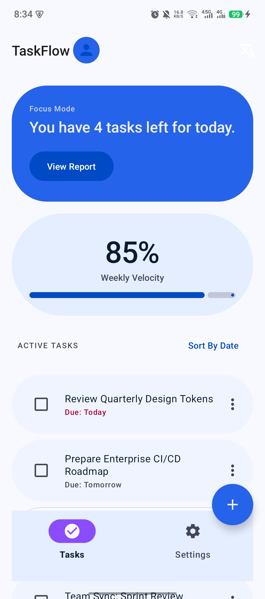
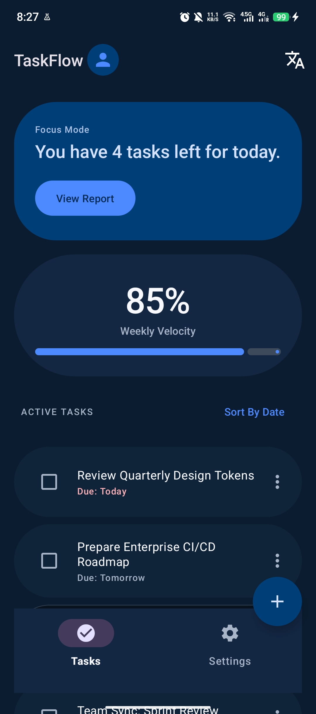
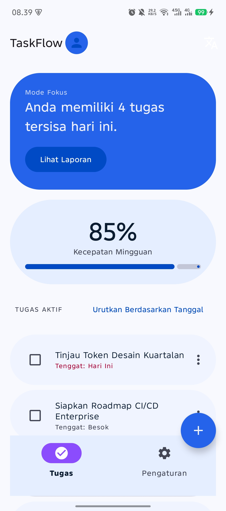
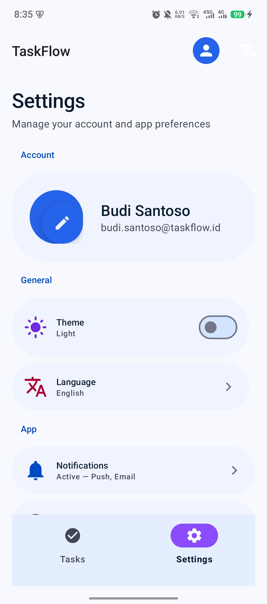
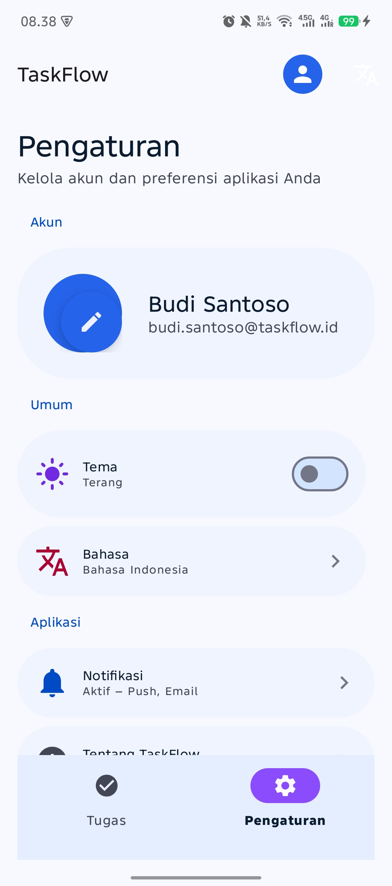
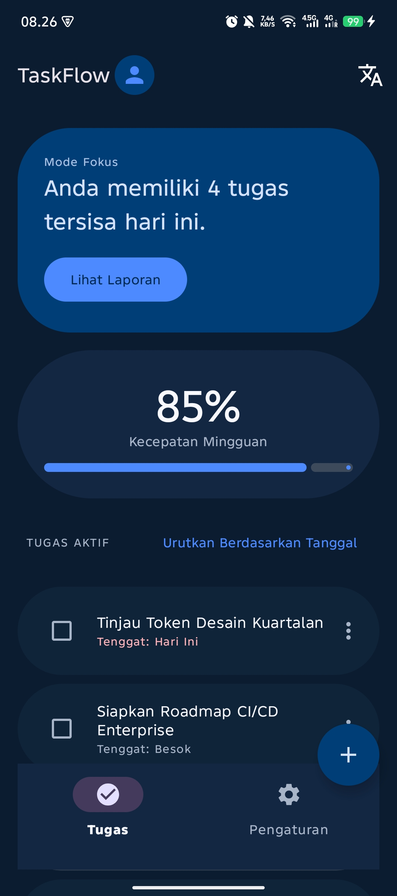

# Tugas 13: Android UI Design — Material Design Implementation

## Identitas

| **Nama** | Fatih Jawwad Al Mumtaz |
|----------|------------------------|
| **NIM** | 452024611047 |
| **Kelas** | TI-A2 |
| **Dosen Pengampu** | Wahid Alfaridsi Achmad Zein, M.Kom. |
| **Mata Kuliah** | Pemrograman Mobile |

---

## Bukti Visual

### 1. Light Mode vs Dark Mode (Home)

| Light Mode | Dark Mode |
|------------|-----------|
|  |  |

### 2. Localization (Bahasa Indonesia) — Light Mode

| English (Default) | Bahasa Indonesia |
|-------------------|------------------|
|  |  |
|  |  |

### 3. Localization — Dark Mode

| English | Bahasa Indonesia |
|---------|------------------|
|  |  |

### 4. Komponen Material Design

Semua komponen Material Design terlihat di screenshot di atas:
- **MaterialCardView** — Welcome hero card, task list cards, velocity card
- **FloatingActionButton (FAB) di CoordinatorLayout** — Add Task FAB
- **BottomNavigationView** — Navigasi antara Tasks dan Settings
- **MaterialSwitch** — Theme toggle di Settings
- **Snackbar** — Feedback untuk setiap aksi pengguna (dijalankan via kode)

---

## Komponen Material Design yang Diimplementasikan

| No | Komponen | Lokasi |
|----|----------|--------|
| 1 | **FloatingActionButton (FAB)** + CoordinatorLayout | `activity_home.xml` (FAB add task) + `activity_settings.xml` (mini FAB) |
| 2 | **BottomNavigationView** | `activity_home.xml`, `activity_settings.xml` |
| 3 | **MaterialCardView** | 7 cards di Home + 5 cards di Settings |
| 4 | **Snackbar** | Digunakan di seluruh aksi: navigasi, checkbox, tombol |
| 5 | **TextInputLayout + TextInputEditText (OutlinedBox)** | `activity_settings.xml` |

---

## Fitur Tambahan

| Fitur | Implementasi |
|-------|-------------|
| **Dark Theme** | `res/values-night/themes.xml` + `values-night/colors.xml` dengan palet dark blue tones |
| **Typography (Type Scale)** | `res/values/typography.xml` — 9 custom TextAppearance styles dengan parent `TextAppearance.Material3.*`, semua dalam satuan `sp` |
| **Localization (ID)** | `res/values-b+id/strings.xml` (Android 15+) + `res/values-in/strings.xml` (pre-Android 15) — dual folder biar kompatibel semua versi Android |
| **Locale Config** | `res/xml/locales_config.xml` — declared di manifest via `android:localeConfig` untuk Android 13+ |
| **Language Split** | `bundle { language { enableSplit = false } }` di `build.gradle.kts` — mencegah stripping bahasa di App Bundle |
| **RTL Support** | `android:supportsRtl="true"` di manifest, semua layout menggunakan `start`/`end` |
| **ViewBinding** | Semua activity menggunakan ViewBinding untuk type-safe view access |
| **Fade Transitions** | Transisi halus antara Home ↔ Settings |

---

## Tingkat Prioritas (Precedence) Styling

Dalam Android Styling System, jika sebuah view memiliki pengaturan yang sama di tiga level (Theme, Style, dan View Attributes), urutan prioritas dari **tertinggi ke terendah** adalah:

1. **View Attributes** (inline) — prioritas tertinggi, ditulis langsung di elemen XML view (misal `android:textColor="#FF0000"` pada TextView)
2. **Styles** — diterapkan via `style="@style/..."` pada view, dapat di-override oleh View Attributes
3. **Theme** — diterapkan di level aplikasi/activity via `android:theme`, prioritas terendah

Contoh: jika Theme mendefinisikan `colorPrimary = #FF0000`, Style mendefinisikan `android:textColor = @color/blue`, dan View Attributes mendefinisikan `android:textColor = "#00FF00"`, maka warna teks yang tampil adalah **hijau (#00FF00)** karena View Attributes memiliki prioritas tertinggi.

---

## Build & Run

```bash
# Clone repository
git clone https://github.com/jaweed3/Tugas13_Android_UI_Design_452024611047.git

# Buka di Android Studio
# Sync Gradle
# Run di emulator/device
```

**Minimum SDK:** 24 (Android 7.0)
**Target SDK:** 35 (Android 15)
**Compile SDK:** 35
